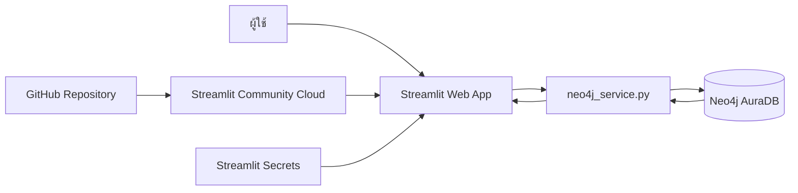
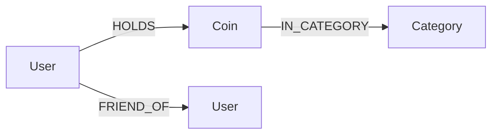

# คู่มือสร้างระบบแนะนำเหรียญ Crypto ด้วย Neo4j Aura + Streamlit

> โปรเจ็คนี้เป็นตัวอย่างเชิงวิชาการเรื่องโครงสร้าง Graph เท่านั้น ไม่ใช่คำแนะนำการลงทุน

## 1) เป้าหมายการเรียนรู้

เมื่อทำโปรเจ็คนี้เสร็จ นักศึกษาควรสามารถ

1. ออกแบบ Property Graph จากโจทย์ระบบจริง
2. อธิบาย Node, Label, Property, Relationship และ Direction
3. เขียน Cypher สำหรับ CRUD, traversal และ aggregation
4. เชื่อม Python กับ Neo4j Aura ด้วย official Neo4j Python Driver
5. สร้าง Recommendation ที่อธิบายเหตุผลได้จากความสัมพันธ์ในกราฟ
6. พัฒนา Web UI ด้วย Streamlit
7. แยก secret/credential ออกจาก source code
8. deploy ระบบจาก GitHub ไป Streamlit Community Cloud

---

## 2) สถาปัตยกรรมระบบ



แยกเป็น 4 ชั้น

- **Presentation layer:** `app.py`
- **Database access layer:** `neo4j_service.py`
- **Graph database:** Neo4j AuraDB
- **Deployment/configuration:** GitHub + Streamlit Community Cloud + Secrets

---

## 3) Graph Data Model



### Node

| Label | Primary property | หน้าที่ |
|---|---|---|
| User | name | ผู้ใช้ระบบ |
| Coin | symbol | เหรียญ Crypto |
| Category | name | หมวดของเหรียญ เช่น Layer1, Exchange, Payment, Meme |

### Relationship

| Relationship | Source → Target | Property | ความหมาย |
|---|---|---|---|
| HOLDS | User → Coin | - | ผู้ใช้ถือหรือสนใจเหรียญนี้ |
| IN_CATEGORY | Coin → Category | - | หมวดของเหรียญ (เหรียญละไม่เกิน 1 หมวด) |
| FRIEND_OF | User → User | shared_coins, weight | ผู้ใช้ 2 คนถือเหรียญเดียวกันอย่างน้อย 1 เหรียญ |

> `FRIEND_OF` ถูกสร้างเพียงหนึ่ง relationship ต่อคู่ (จากชื่อที่มาก่อนตามตัวอักษรไปชื่อที่มาหลัง)
> และ query แบบ `-[:FRIEND_OF]-` เพื่อมองว่าเป็นความสัมพันธ์แบบสมมาตร

### ข้อมูลตัวอย่าง

ผู้ใช้ 10 คน เหรียญ 8 เหรียญ และ `HOLDS` 26 เส้น

```text
Anan → BTC, ETH            Fah  → BTC, XRP
Bee  → BTC, ETH, SOL       Gun  → DOGE, PEPE
Chai → BTC, BNB            Ice  → ETH, ADA, XRP
Dao  → SOL, DOGE           Jane → BTC, ETH, BNB, SOL
Earn → ETH, SOL, ADA       Kong → SOL, PEPE, DOGE
```

หมวดหมู่: Layer1 (BTC, ETH, SOL, ADA) · Exchange (BNB) · Payment (XRP) · Meme (DOGE, PEPE)

---

## 4) เหตุผลที่ Graph Database เหมาะกับโจทย์นี้

ใน RDBMS การหา “เหรียญที่คนพอร์ตคล้ายกับเราถือ แต่เรายังไม่มี” ต้อง JOIN ตารางการถือเหรียญกับตัวเองหลายรอบ

ใน Graph เขียนเป็น pattern ได้ใกล้เคียงกับโจทย์โดยตรง

```cypher
MATCH (me:User {name: $name})-[:HOLDS]->(:Coin)<-[:HOLDS]-(other:User)-[:HOLDS]->(rec:Coin)
WHERE other <> me
  AND NOT EXISTS { MATCH (me)-[:HOLDS]->(rec) }
RETURN rec.symbol AS coin, count(*) AS score
ORDER BY score DESC, coin
```

จุดสำคัญคือเรา query **ความสัมพันธ์และเส้นทาง** ไม่ได้มองเฉพาะ record แยกตาราง

---

## 5) Recommendation Algorithm

### แบบที่ 1: 3 hop ผ่าน HOLDS

```text
ผู้ใช้ → เหรียญที่ถือ → ผู้ใช้อื่นที่ถือเหรียญเดียวกัน → เหรียญที่ผู้ใช้ยังไม่มี
```

`score = count(*)` คือจำนวนเส้นทางที่เดินไปถึงเหรียญนั้น ยิ่งมากแปลว่าเชื่อมโยงกันหลายทาง ไม่ใช่บังเอิญตรงกันจุดเดียว

ตัวอย่าง Anan ถือ BTC และ ETH จะได้ `SOL 5, BNB 3, ADA 2, XRP 2`
SOL ได้ 5 คะแนนเพราะเดินผ่าน BTC → Bee, Jane และ ETH → Bee, Earn, Jane
ส่วน DOGE และ PEPE ไม่ถูกแนะนำ เพราะไม่มีใครที่พอร์ตทับซ้อนกับ Anan ถือเหรียญสาย Meme

### แบบที่ 2: 2 hop ผ่าน FRIEND_OF

```text
ผู้ใช้ -[:FRIEND_OF]- เพื่อน -[:HOLDS]-> เหรียญที่ผู้ใช้ยังไม่มี
```

- `friend_score` = จำนวนเพื่อนที่ถือเหรียญนั้น
- `weighted_score` = ผลรวม `weight` ของเพื่อนเหล่านั้น ได้ค่าเท่ากับคะแนนแบบ 3 hop เพราะ `weight` คือจำนวนเหรียญร่วม ซึ่งเท่ากับจำนวนเส้นทางที่เดินผ่าน

### แบบที่ 3: ตามหมวดหมู่ (แก้ปัญหา Cold Start)

```text
ผู้ใช้ → เหรียญที่ถือ → หมวดหมู่ → เหรียญอื่นในหมวดเดียวกัน
```

ไม่ต้องพึ่งผู้ใช้คนอื่นเลย จึงแนะนำได้แม้ผู้ใช้ใหม่ยังไม่มีใครถือเหรียญซ้ำกัน
เช่น Gun ถือแต่ DOGE กับ PEPE จึงเชื่อมกับส่วนอื่นของกราฟได้น้อยมากเมื่อใช้แบบที่ 1 และ 2

---

## 6) Explainable Recommendation

ระบบไม่ได้คืนเพียงเหรียญและคะแนน แต่คืนหลักฐานด้วย

| แบบ | หลักฐานที่คืนมา |
|---|---|
| 3 hop | `via_users` ผู้ใช้ที่พอร์ตคล้ายกันซึ่งถือเหรียญนั้น |
| FRIEND_OF | `from_friends` เพื่อนที่ถือเหรียญนั้น |
| หมวดหมู่ | `categories` หมวดที่ตรงกับเหรียญที่ถืออยู่ |

นักศึกษาจึง trace กลับไปยัง graph pattern ที่ทำให้เกิดคำแนะนำได้

---

## 7) FRIEND_OF เป็น Derived Relationship

`FRIEND_OF` ไม่ได้ถูกพิมพ์เข้าไปเอง แต่ให้ Neo4j หาจาก `HOLDS`

```cypher
MATCH (a:User)-[:HOLDS]->(c:Coin)<-[:HOLDS]-(b:User)
WHERE a.name < b.name
WITH a, b, c ORDER BY c.symbol
WITH a, b, collect(c.symbol) AS shared
MERGE (a)-[f:FRIEND_OF]->(b)
SET f.shared_coins = shared, f.weight = size(shared)
```

- `a.name < b.name` สร้างเส้นเดียวต่อคู่ กัน Anan→Bee กับ Bee→Anan ซ้ำกัน
- `shared_coins` เก็บเหรียญที่ถือร่วมกัน
- `weight` คือจำนวนเหรียญที่ถือร่วมกัน ยิ่งมากยิ่งพอร์ตคล้ายกัน

เมื่อแอปแก้ไขข้อมูลได้ ข้อมูลที่คำนวณไว้ก็ล้าสมัยได้ เช่น ลบ `HOLDS` เส้นเดียวอาจทำให้เพื่อนบางคู่หายไป
แอปจึงลบ `FRIEND_OF` ทั้งหมดแล้วสร้างใหม่ **ในทรานแซกชันเดียวกับการแก้ไข** ผ่านฟังก์ชัน `_write(..., sync_friends=True)`
ถ้าขั้นตอนใดล้มเหลว ทั้งทรานแซกชันจะถูกยกเลิก ข้อมูลจึงไม่ค้างอยู่ในสภาพที่ `HOLDS` กับ `FRIEND_OF` ไม่ตรงกัน

| การแก้ไข | ต้องสร้าง FRIEND_OF ใหม่หรือไม่ | เหตุผล |
|---|---|---|
| เพิ่ม/ลบ `HOLDS` หรือแก้พอร์ต | ใช่ | เหรียญที่ถือร่วมกันเปลี่ยน |
| เปลี่ยนชื่อผู้ใช้ | ใช่ | ทิศของเส้นขึ้นกับ `a.name < b.name` |
| เปลี่ยนสัญลักษณ์เหรียญ | ใช่ | `shared_coins` เก็บสัญลักษณ์ไว้ |
| ลบเหรียญ | ใช่ | เหรียญที่ถือร่วมกันลดลง |
| ลบผู้ใช้ | ไม่ | `DETACH DELETE` ลบเส้นของผู้ใช้นั้นไปแล้ว |
| แก้หมวดหมู่ | ไม่ | ไม่เกี่ยวกับ `HOLDS` |

---

## 8) Constraint และ CRUD

สร้าง key ของ node ให้ unique

```cypher
CREATE CONSTRAINT user_name_unique IF NOT EXISTS
FOR (u:User) REQUIRE u.name IS UNIQUE;
```

แอปสร้าง constraint ทั้ง 3 ตัวให้อัตโนมัติเมื่อเริ่มทำงาน เพื่อกันข้อมูลซ้ำและทำให้ `MATCH` เร็วขึ้น

| งาน | Cypher ที่ใช้ |
|---|---|
| เพิ่ม | `CREATE (:User {name: $name})` หลังตรวจว่ายังไม่มีชื่อนี้ |
| แก้ไข | `MATCH (u:User {name: $name}) SET u.name = $new_name` |
| ลบ node | `MATCH (u:User {name: $name}) DETACH DELETE u` |
| เพิ่มความสัมพันธ์ | `MATCH (u:User {...}), (c:Coin {...}) MERGE (u)-[:HOLDS]->(c)` |
| ลบความสัมพันธ์ | `MATCH (:User {...})-[r:HOLDS]->(:Coin {...}) DELETE r` |
| ข้อมูลตัวอย่าง | `UNWIND $rows AS row MERGE ...` รันซ้ำได้โดยไม่เกิดข้อมูลซ้ำ |

`DETACH DELETE` ลบ node พร้อมความสัมพันธ์ทั้งหมดของมัน ส่วน `DELETE` กับ node ที่ยังมีความสัมพันธ์อยู่จะ error

---

## 9) Parameterized Cypher

ไม่ควรเขียน

```python
cypher = "MATCH (u:User {name:'" + name + "'}) RETURN u"
```

ควรเขียน

```python
cypher = "MATCH (u:User {name: $name}) RETURN u"
params = {"name": name}
```

แล้วส่ง parameter ผ่าน Neo4j Driver ซึ่งทำให้โค้ดอ่านง่ายและหลีกเลี่ยงการนำ input ไปประกอบ query string โดยตรง
ประเด็นนี้สำคัญขึ้นเมื่อผู้ใช้พิมพ์ชื่อและสัญลักษณ์เหรียญเข้ามาเองได้

---

## 10) การเชื่อมต่อ Neo4j Aura

`neo4j_service.py` สร้าง `Driver` เพียงหนึ่งตัวและ cache ด้วย `@st.cache_resource`
ถ้าไม่ได้ระบุ `database` ใน Secrets จะใช้ home database เหมือนใน Notebook

```python
@st.cache_resource(show_spinner=False)
def _connect():
    driver = GraphDatabase.driver(uri, auth=(username, password))
    driver.verify_connectivity()
    database = cfg.get("database") or driver.execute_query("SHOW HOME DATABASE").records[0]["name"]
    return driver, database
```

การอ่านใช้ `driver.execute_query()` ส่วนการเขียนที่มีหลายคำสั่งใช้ transaction function

```python
with driver.session(database=database) as session:
    session.execute_write(work)
```

---

## 11) หน้าจอของระบบ

| เมนู | รายละเอียด |
|---|---|
| หน้า Hub | รวมการบ้าน 4 การ์ด การ์ด 01-03 เปิดไฟล์ในโฟลเดอร์ `homework/` การ์ด 04 เข้าสู่ระบบแนะนำ |
| แนะนำเหรียญ | จำนวน User, Coin, Category, HOLDS, FRIEND_OF เลือกผู้ใช้และ Top-N ดูพอร์ต เพื่อน และคำแนะนำทั้ง 3 แบบพร้อมเหตุผล |
| จัดการคน & เพื่อน | เพิ่ม เปลี่ยนชื่อ ลบผู้ใช้ ดู `FRIEND_OF` และสั่งคำนวณใหม่ |
| จัดการเหรียญ & การถือ | เพิ่ม แก้ไข ลบเหรียญและหมวดหมู่ (`IN_CATEGORY`) และแก้ `HOLDS` |
| กราฟความสัมพันธ์ | วาดทั้งกราฟหรือรอบผู้ใช้หนึ่งคน เลือกชนิดความสัมพันธ์ที่แสดงได้ |
| ตั้งค่าข้อมูล | สร้างข้อมูลตัวอย่าง และล้างข้อมูล User / Coin / Category |

---

## 12) Secrets

สร้าง local file

```text
.streamlit/secrets.toml
```

เนื้อหา

```toml
[neo4j]
uri = "neo4j+s://YOUR_INSTANCE.databases.neo4j.io"
username = "YOUR_USERNAME"
password = "YOUR_PASSWORD"
```

ห้าม commit ไฟล์นี้ขึ้น GitHub โดย `.gitignore` ของโปรเจ็คเตรียมไว้แล้ว
ก่อน push ตรวจด้วย `git status` ว่าไฟล์นี้ไม่อยู่ใน staged files

---

## 13) Deploy Streamlit Community Cloud

1. เปิด Streamlit Community Cloud
2. Create app
3. เลือก GitHub repository
4. branch = `main`
5. main file = `app.py`
6. Advanced settings → Secrets
7. paste ค่า `[neo4j] ...`
8. Deploy

เมื่อ app เริ่มทำงานจะติดตั้ง package ตาม `requirements.txt`

---

## 14) ลำดับ Lab ที่แนะนำ

1. **Graph Model** วาด Node/Relationship ก่อนเขียนโปรแกรม
2. **Seed Data** สร้าง constraint และใช้ `UNWIND + MERGE`
3. **Basic Cypher** `MATCH`, `WHERE`, `RETURN`, `ORDER BY`
4. **Traversal** เดิน 1 hop, 2 hop และ 3 hop จากผู้ใช้
5. **Aggregation** `count(*)`, `sum(f.weight)`, `collect()`
6. **Derived Relationship** สร้าง `FRIEND_OF` จาก `HOLDS`
7. **Recommendation** เปรียบเทียบคำแนะนำทั้ง 3 แบบ
8. **CRUD** `CREATE`, `SET`, `DELETE`, `DETACH DELETE` ผ่าน Python Driver
9. **Streamlit** สร้าง UI และ state จาก widget
10. **Deployment** GitHub + Secrets + Streamlit Cloud

---

## 15) แนวทางต่อยอด

1. Authentication และ Role: User/Admin
2. เพิ่ม property บน `HOLDS` เช่น จำนวนเหรียญ หรือแยก `HOLDS` กับ `WATCHES`
3. ถ่วงน้ำหนักคะแนนด้วยความคล้ายของพอร์ต เช่น Jaccard similarity
4. รวมคะแนนหลายแบบเป็น Hybrid Score
5. Neo4j Graph Data Science: node similarity, PageRank, community detection
6. Precision@K, Recall@K, NDCG@K
7. ดึงราคาหรือ market cap จาก API ภายนอกมาเป็น property ของ `Coin`
